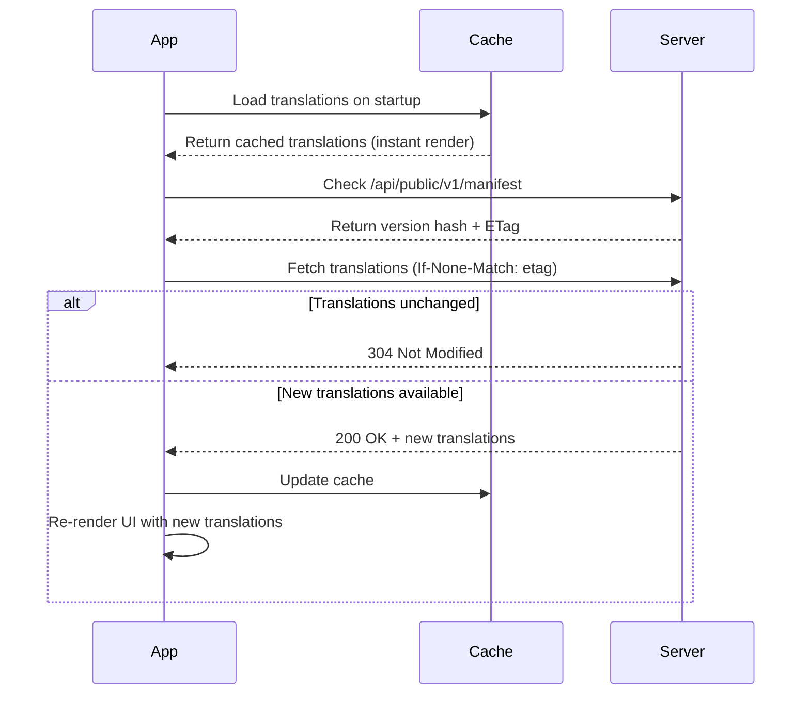

<div align="center">

# Lokalise

**Self-hosted, open-source translation management platform with OTA updates**

[](LICENSE)
[](https://www.typescriptlang.org/)
[](https://www.docker.com/)
[](.github/CONTRIBUTING.md)
[](#contributors)

[Features](#-features) • [Quick Start](#-quick-start) • [Documentation](#-documentation) • [Contributing](#-contributing) • [Community](#-community)

</div>

---

## Overview

Lokalise is a modern, self-hosted translation management platform built for teams who need complete control over their localization workflow. Push translation updates to mobile apps instantly without app store releases, manage translations through an intuitive web interface, and integrate seamlessly with React Native, Expo, and web applications.

### Why Lokalise?

- **Over-the-Air (OTA) Updates** – Update app translations instantly without redeploying
- **Self-Hosted** – Keep your translation data on your infrastructure
- **Lightning Fast** – Built with Bun, Hono, and modern tech for maximum performance
- **Secure by Default** – Multi-tenant architecture with organization-based access control
- **Mobile-First** – React Native SDK with AsyncStorage caching and automatic updates
- **i18next Compatible** – Import/export standard JSON formats
- **Beautiful UI** – Modern admin panel built with Nuxt 4 and Nuxt UI

---

## Features

### Translation Management
- **Spreadsheet-style Editor** – Manage translation keys across multiple locales in an intuitive interface
- **Namespace Organization** – Group translations logically (common, errors, features, etc.)
- **Translation States** – Track draft, published, and custom workflow states
- **Version History** – Automatic versioning with complete audit trail
- **Bulk Import/Export** – i18next-compatible JSON (nested or flat format)
- **Search & Filter** – Quickly find keys by namespace, locale, or status

### Mobile & Web Integration
- **Over-the-Air Updates** – Push translation changes to production apps instantly
- **React Native SDK** – Drop-in `<LokaliseProvider>` with `useTranslation()` hook
- **Instant Rendering** – Apps render from cache immediately, update in background
- **Smart Polling** – Configurable automatic translation checks (default: 30s)
- **ETag Optimization** – Efficient 304 responses minimize bandwidth usage
- **AsyncStorage Caching** – Offline-first architecture for mobile apps

### 🔐 Security & Multi-tenancy
- **Organization-Based Access** – Complete data isolation between tenants
- **Dual Authentication** – Session auth for admin, API keys for public endpoints
- **Per-Project API Keys** – Rotate keys without downtime
- **Better Auth Integration** – Email/password authentication with organization management
- **CORS Protection** – Configurable origins and secure headers

### Developer Experience
- **Modern Tech Stack** – Bun, Hono, PostgreSQL, Nuxt 4, Drizzle ORM
- **Type-Safe** – End-to-end TypeScript with strict mode
- **Docker Ready** – Multi-service stack with one command
- **Monorepo** – pnpm workspaces + Turborepo for fast builds
- **Hot Reload** – Instant feedback during development
- **Database GUI** – Built-in Drizzle Studio for schema exploration

---

## Tech Stack

<table>
  <tr>
    <td><strong>API</strong></td>
    <td>Hono + Bun (blazing fast HTTP server)</td>
  </tr>
  <tr>
    <td><strong>Database</strong></td>
    <td>PostgreSQL 17 + Drizzle ORM</td>
  </tr>
  <tr>
    <td><strong>Admin UI</strong></td>
    <td>Nuxt 4 + Nuxt UI v3 + Vue 3</td>
  </tr>
  <tr>
    <td><strong>Auth</strong></td>
    <td>Better Auth (email/password + organizations)</td>
  </tr>
  <tr>
    <td><strong>Mobile SDK</strong></td>
    <td>React (compatible with React Native + Expo)</td>
  </tr>
  <tr>
    <td><strong>Monorepo</strong></td>
    <td>pnpm workspaces + Turborepo</td>
  </tr>
  <tr>
    <td><strong>Deployment</strong></td>
    <td>Docker Compose</td>
  </tr>
</table>

---

## Quick Start

### Prerequisites

- **Docker** (for containerized deployment)
- **OR** for local development:
  - [Bun](https://bun.sh) >= 1.0 or [pnpm](https://pnpm.io) >= 8.0
  - PostgreSQL >= 15

### Option 1: Docker (Recommended for Production)

```bash
# Clone the repository
git clone https://github.com/allanasp/lokalise.git
cd lokalise

# Copy and configure environment variables
cp .env.example .env

# Edit .env - Set these REQUIRED variables:
# - DB_PASSWORD (strong password for PostgreSQL)
# - BETTER_AUTH_SECRET (generate with: openssl rand -hex 32)
nano .env

# Start the entire stack
docker compose up -d
```

**Services will be available at:**
- **Admin UI**: http://localhost:3001
- 🔌 **API**: http://localhost:3000
- 🗄️ **PostgreSQL**: localhost:5432

Database migrations run automatically on first startup.

### Option 2: Local Development

```bash
# Clone and install dependencies
git clone https://github.com/allanasp/lokalise.git
cd lokalise
pnpm install

# Create database
createdb lokalise

# Configure environment
cp .env.example .env
# Edit .env with your DATABASE_URL and BETTER_AUTH_SECRET

# Run migrations
pnpm run db:migrate

# Start all services (API on :3000, Web on :3001)
pnpm run dev
```

### First Steps

1. **Open** http://localhost:3001
2. **Register** a new account
3. **Create** your first organization
4. **Create** a project and get your API key
5. **Add** locales (en, da, de, etc.)
6. **Import** translations or create keys manually

---

## React Native SDK

### Installation

```bash
npm install @lokalise/sdk-react @react-native-async-storage/async-storage
# or
yarn add @lokalise/sdk-react @react-native-async-storage/async-storage
```

### Basic Usage

```tsx
import { LokaliseProvider, useTranslation } from "@lokalise/sdk-react";

// 1. Wrap your app
export default function App() {
  return (
    <LokaliseProvider
      apiKey="lok_your_project_api_key"
      baseUrl="https://your-lokalise-server.com"
      defaultLocale="en"
      namespaces={["default"]}
      pollInterval={30000} // Check for updates every 30s
    >
      <MyApp />
    </LokaliseProvider>
  );
}

// 2. Use translations in components
function MyScreen() {
  const { t, locale, setLocale } = useTranslation("default");

  return (
    <View>
      <Text>{t("welcome.greeting", { name: "World" })}</Text>
      <Text>{t("items.count", { count: 5 })}</Text>
      <Button onPress={() => setLocale("da")} title="Switch to Danish" />
    </View>
  );
}
```

### How OTA Works



**Benefits:**
- Apps start instantly from cache
- Updates happen in background
- Minimal bandwidth usage (ETag caching)
- No app store releases needed

---

## Architecture

### System Overview

```
┌─────────────────────────────────────────────────────────────┐
│                     Admin UI (Nuxt 4)                       │
│  ┌──────────────┐  ┌──────────────┐  ┌──────────────┐     │
│  │  Login Page  │  │   Projects   │  │  Translation  │     │
│  │              │  │   Dashboard  │  │    Editor     │     │
│  └──────────────┘  └──────────────┘  └──────────────┘     │
└────────────────────────────┬────────────────────────────────┘
                             │ Session Auth (Better Auth)
                             ▼
┌─────────────────────────────────────────────────────────────┐
│                    REST API (Hono + Bun)                    │
│  ┌──────────────────────────────────────────────────────┐  │
│  │  Admin API (/api/v1/*)                               │  │
│  │  - Projects, Locales, Keys, Translations             │  │
│  │  - Import/Export, Version History                    │  │
│  │  Auth: Session cookies + x-organization-id header    │  │
│  └──────────────────────────────────────────────────────┘  │
│  ┌──────────────────────────────────────────────────────┐  │
│  │  Public API (/api/public/v1/*)                       │  │
│  │  - Get translations, manifest                        │  │
│  │  Auth: x-api-key header                              │  │
│  └──────────────────────────────────────────────────────┘  │
└────────────────────────────┬────────────────────────────────┘
                             │ Drizzle ORM
                             ▼
                   ┌──────────────────┐
                   │   PostgreSQL 17  │
                   │                  │
                   │  - users         │
                   │  - organizations │
                   │  - projects      │
                   │  - locales       │
                   │  - keys          │
                   │  - translations  │
                   └──────────────────┘

┌─────────────────────────────────────────────────────────────┐
│              Mobile Apps (React Native/Expo)                │
│  ┌──────────────────────────────────────────────────────┐  │
│  │  @lokalise/sdk-react                                 │  │
│  │  - AsyncStorage cache                                │  │
│  │  - Polling (30s default)                             │  │
│  │  - ETag optimization                                 │  │
│  └──────────────────────────────────────────────────────┘  │
└────────────────────────────┬────────────────────────────────┘
                             │ x-api-key: lok_***
                             │ GET /api/public/v1/translations
                             └──────────────────────────────────
```

### Database Schema

**Core Tables:**
- `projects` – Translation projects with API keys
- `locales` – Languages (en, da, de, etc.)
- `translation_keys` – Keys with namespace grouping
- `translations` – Values with versioning and status
- `translation_history` – Complete audit trail

**Auth Tables (Better Auth):**
- `user` – User accounts
- `session` – Active sessions
- `organization` – Multi-tenant organizations
- `member` – Organization memberships

---

## Performance

### Benchmarks

| Metric | Value | Notes |
|--------|-------|-------|
| **API Response Time** | < 10ms | Average for translation fetch with cache |
| **Database Queries** | 1-3 per request | Optimized with Drizzle ORM |
| **OTA Update Size** | ~5-50KB | Depends on translation count |
| **Cold Start (Mobile)** | < 100ms | AsyncStorage cache load |
| **Hot Start (Mobile)** | < 20ms | Memory cache hit |
| **Concurrent Users** | 1000+ | Tested with Docker (2 CPU, 4GB RAM) |
| **Projects per Org** | Unlimited | Limited only by database capacity |

### Scaling Recommendations

**Small Teams (< 10 users, < 5 apps):**
- Docker Compose on single VPS
- 2 CPU cores, 4GB RAM
- PostgreSQL on same host

**Medium Teams (10-100 users, 5-20 apps):**
- Kubernetes deployment
- 4 CPU cores, 8GB RAM
- Separate PostgreSQL instance
- CDN for static assets

**Large Teams (100+ users, 20+ apps):**
- Kubernetes with autoscaling
- Read replicas for PostgreSQL
- Redis for session storage
- CDN + edge caching

---

## Documentation

### API Reference

Full API documentation with examples:

- [Admin API Endpoints](docs/api/admin.md)
- [Public API Endpoints](docs/api/public.md)
- [Authentication Guide](docs/api/auth.md)
- [Error Codes](docs/api/errors.md)

### Guides

Step-by-step tutorials:

- [Getting Started](docs/guides/getting-started.md)
- [React Native Integration](docs/guides/react-native.md)
- [Import/Export Translations](docs/guides/import-export.md)
- [Organization Management](docs/guides/organizations.md)
- [Production Deployment](docs/guides/deployment.md)
- [Backup & Restore](docs/guides/backup.md)

### Development

Contributing to Lokalise:

- [Development Setup](docs/development/setup.md)
- [Project Structure](docs/development/structure.md)
- [Database Migrations](docs/development/migrations.md)
- [Running Tests](docs/development/testing.md)

---

## Available Scripts

```bash
# Development
pnpm run dev          # Start all services (API + Web + DB Studio)
pnpm run dev:api      # Start API only
pnpm run dev:web      # Start web UI only

# Building
pnpm run build        # Build all packages
pnpm run build:api    # Build API only
pnpm run build:web    # Build web UI only

# Code Quality
pnpm run lint         # Check code with Biome
pnpm run lint:fix     # Fix linting issues automatically
pnpm run format       # Format code with Biome
pnpm run typecheck    # Type check TypeScript files

# Database
pnpm run db:generate  # Generate new migration from schema changes
pnpm run db:migrate   # Apply pending migrations
pnpm run db:studio    # Open Drizzle Studio (database GUI)
pnpm run db:seed      # Seed database with sample data

# Docker
docker compose up -d              # Start all services
docker compose down               # Stop all services
docker compose logs -f api        # View API logs
docker compose exec postgres psql # Access PostgreSQL CLI
```

---

## Use Cases

### 1. Mobile App Translation
A fintech app with 50,000+ users needs to support 10 languages. Using Lokalise:
- Translators update copy daily through web UI
- Changes go live instantly via OTA (no app store review)
- Users see updates within 30 seconds
- Zero downtime, zero re-deployments

### 2. Multi-Brand SaaS Platform
A SaaS company runs 20 white-labeled apps with different translations:
- Each brand gets a separate project
- Translators collaborate in organizations
- API keys keep data isolated
- Bulk export integrates with i18next

### 3. 🎮 Game Localization
A game studio localizes to 25 languages with seasonal events:
- Developers push key changes via import API
- Translators work in parallel
- QA reviews drafts before publishing
- Event translations go live synchronized

### 4. 🏢 Enterprise Internal Tools
A corporation with 100+ internal apps needs centralized translations:
- IT manages one Lokalise instance
- Each team gets an organization
- Self-hosted for compliance
- Complete audit trail for governance

---

## Contributing

We love contributions! Whether it's bug reports, feature requests, or pull requests, all contributions are welcome.

### Ways to Contribute

- **Report Bugs** – [Open an issue](.github/ISSUE_TEMPLATE/bug_report.md)
- **Request Features** – [Suggest an enhancement](.github/ISSUE_TEMPLATE/feature_request.md)
- **Improve Docs** – Help us make documentation clearer
- **Submit PRs** – Check our [Contributing Guide](.github/CONTRIBUTING.md)
- **Star the Project** – Show your support!

### Development Setup

```bash
# Fork and clone
git clone https://github.com/YOUR_USERNAME/lokalise.git
cd lokalise

# Install dependencies
pnpm install

# Create feature branch
git checkout -b feature/amazing-feature

# Make changes and test
pnpm run dev
pnpm run lint
pnpm run typecheck

# Commit using conventional commits
git commit -m "feat: add amazing feature"

# Push and create PR
git push origin feature/amazing-feature
```

See [CONTRIBUTING.md](.github/CONTRIBUTING.md) for detailed guidelines.

---

## Security

Security is a top priority. If you discover a security vulnerability:

- **DO NOT** open a public issue
- Email security details to: **security@yourproject.com**
- We'll respond within 48 hours

See [SECURITY.md](SECURITY.md) for our full security policy.

---

## License

This project is licensed under the **MIT License** – see the [LICENSE](LICENSE) file for details.

This means you can:
- Use commercially
- Modify
- Distribute
- Use privately

---

## Community & Support

### Get Help

- **Documentation**: [Full docs](docs/)
- 💬 **GitHub Discussions**: [Ask questions](https://github.com/allanasp/lokalise/discussions)
- **Issue Tracker**: [Report bugs](https://github.com/allanasp/lokalise/issues)
- 📧 **Email**: support@yourproject.com

### Stay Updated

- **Star this repo** to stay notified of updates
- **Star this repo** to stay notified of updates
- **Watch releases** for new features

## Contributors
## Contributors

Thanks to all our contributors:

- **allanasp** - 9 commits

Want to contribute? Check out our [Contributing Guide](.github/CONTRIBUTING.md).
## Contributors
## Contributors

Thanks to all our contributors:

- **allanasp** - 9 commits

Want to contribute? Check out our [Contributing Guide](.github/CONTRIBUTING.md).

Thanks to all our contributors:

- **allanasp** - 9 commits

Want to contribute? Check out our [Contributing Guide](.github/CONTRIBUTING.md).
## Contributors
## Contributors

Thanks to all our contributors:

- **allanasp** - 9 commits

Want to contribute? Check out our [Contributing Guide](.github/CONTRIBUTING.md).
## Contributors
## Contributors

Thanks to all our contributors:

- **allanasp** - 9 commits

Want to contribute? Check out our [Contributing Guide](.github/CONTRIBUTING.md).

Thanks to all our contributors:

- **allanasp** - 9 commits

Want to contribute? Check out our [Contributing Guide](.github/CONTRIBUTING.md).

Thanks to all our contributors:

- **allanasp** - 9 commits

Want to contribute? Check out our [Contributing Guide](.github/CONTRIBUTING.md).
## Contributors
## Contributors

Thanks to all our contributors:

- **allanasp** - 9 commits

Want to contribute? Check out our [Contributing Guide](.github/CONTRIBUTING.md).
## Contributors
## Contributors

Thanks to all our contributors:

- **allanasp** - 9 commits

Want to contribute? Check out our [Contributing Guide](.github/CONTRIBUTING.md).

Thanks to all our contributors:

- **allanasp** - 9 commits

Want to contribute? Check out our [Contributing Guide](.github/CONTRIBUTING.md).
## Contributors
## Contributors

Thanks to all our contributors:

- **allanasp** - 9 commits

Want to contribute? Check out our [Contributing Guide](.github/CONTRIBUTING.md).
## Contributors
## Contributors

Thanks to all our contributors:

- **allanasp** - 9 commits

Want to contribute? Check out our [Contributing Guide](.github/CONTRIBUTING.md).

Thanks to all our contributors:

- **allanasp** - 9 commits

Want to contribute? Check out our [Contributing Guide](.github/CONTRIBUTING.md).

Thanks to all our contributors:

- **allanasp** - 9 commits

Want to contribute? Check out our [Contributing Guide](.github/CONTRIBUTING.md).

Thanks to all our contributors:

- **allanasp** - 9 commits

Want to contribute? Check out our [Contributing Guide](.github/CONTRIBUTING.md).
## Contributors
## Contributors

Thanks to all our contributors:

- **allanasp** - 9 commits

Want to contribute? Check out our [Contributing Guide](.github/CONTRIBUTING.md).
## Contributors
## Contributors

Thanks to all our contributors:

- **allanasp** - 9 commits

Want to contribute? Check out our [Contributing Guide](.github/CONTRIBUTING.md).

Thanks to all our contributors:

- **allanasp** - 9 commits

Want to contribute? Check out our [Contributing Guide](.github/CONTRIBUTING.md).
## Contributors
## Contributors

Thanks to all our contributors:

- **allanasp** - 9 commits

Want to contribute? Check out our [Contributing Guide](.github/CONTRIBUTING.md).
## Contributors
## Contributors

Thanks to all our contributors:

- **allanasp** - 9 commits

Want to contribute? Check out our [Contributing Guide](.github/CONTRIBUTING.md).

Thanks to all our contributors:

- **allanasp** - 9 commits

Want to contribute? Check out our [Contributing Guide](.github/CONTRIBUTING.md).

Thanks to all our contributors:

- **allanasp** - 9 commits

Want to contribute? Check out our [Contributing Guide](.github/CONTRIBUTING.md).
## Contributors
## Contributors

Thanks to all our contributors:

- **allanasp** - 9 commits

Want to contribute? Check out our [Contributing Guide](.github/CONTRIBUTING.md).
## Contributors
## Contributors

Thanks to all our contributors:

- **allanasp** - 9 commits

Want to contribute? Check out our [Contributing Guide](.github/CONTRIBUTING.md).

Thanks to all our contributors:

- **allanasp** - 9 commits

Want to contribute? Check out our [Contributing Guide](.github/CONTRIBUTING.md).
## Contributors
## Contributors

Thanks to all our contributors:

- **allanasp** - 9 commits

Want to contribute? Check out our [Contributing Guide](.github/CONTRIBUTING.md).
## Contributors
## Contributors

Thanks to all our contributors:

- **allanasp** - 9 commits

Want to contribute? Check out our [Contributing Guide](.github/CONTRIBUTING.md).

Thanks to all our contributors:

- **allanasp** - 9 commits

Want to contribute? Check out our [Contributing Guide](.github/CONTRIBUTING.md).

Thanks to all our contributors:

- **allanasp** - 9 commits

Want to contribute? Check out our [Contributing Guide](.github/CONTRIBUTING.md).

Thanks to all our contributors:

- **allanasp** - 9 commits

Want to contribute? Check out our [Contributing Guide](.github/CONTRIBUTING.md).

Thanks to all our contributors:

- **allanasp** - 9 commits

Want to contribute? Check out our [Contributing Guide](.github/CONTRIBUTING.md).
## Contributors
## Contributors

Thanks to all our contributors:

- **allanasp** - 9 commits

Want to contribute? Check out our [Contributing Guide](.github/CONTRIBUTING.md).
## Contributors
## Contributors

Thanks to all our contributors:

- **allanasp** - 9 commits

Want to contribute? Check out our [Contributing Guide](.github/CONTRIBUTING.md).

Thanks to all our contributors:

- **allanasp** - 9 commits

Want to contribute? Check out our [Contributing Guide](.github/CONTRIBUTING.md).
## Contributors
## Contributors

Thanks to all our contributors:

- **allanasp** - 9 commits

Want to contribute? Check out our [Contributing Guide](.github/CONTRIBUTING.md).
## Contributors
## Contributors

Thanks to all our contributors:

- **allanasp** - 9 commits

Want to contribute? Check out our [Contributing Guide](.github/CONTRIBUTING.md).

Thanks to all our contributors:

- **allanasp** - 9 commits

Want to contribute? Check out our [Contributing Guide](.github/CONTRIBUTING.md).

Thanks to all our contributors:

- **allanasp** - 9 commits

Want to contribute? Check out our [Contributing Guide](.github/CONTRIBUTING.md).
## Contributors
## Contributors

Thanks to all our contributors:

- **allanasp** - 9 commits

Want to contribute? Check out our [Contributing Guide](.github/CONTRIBUTING.md).
## Contributors
## Contributors

Thanks to all our contributors:

- **allanasp** - 9 commits

Want to contribute? Check out our [Contributing Guide](.github/CONTRIBUTING.md).

Thanks to all our contributors:

- **allanasp** - 9 commits

Want to contribute? Check out our [Contributing Guide](.github/CONTRIBUTING.md).
## Contributors
## Contributors

Thanks to all our contributors:

- **allanasp** - 9 commits

Want to contribute? Check out our [Contributing Guide](.github/CONTRIBUTING.md).
## Contributors
## Contributors

Thanks to all our contributors:

- **allanasp** - 9 commits

Want to contribute? Check out our [Contributing Guide](.github/CONTRIBUTING.md).

Thanks to all our contributors:

- **allanasp** - 9 commits

Want to contribute? Check out our [Contributing Guide](.github/CONTRIBUTING.md).

Thanks to all our contributors:

- **allanasp** - 9 commits

Want to contribute? Check out our [Contributing Guide](.github/CONTRIBUTING.md).

Thanks to all our contributors:

- **allanasp** - 9 commits

Want to contribute? Check out our [Contributing Guide](.github/CONTRIBUTING.md).
## Contributors
## Contributors

Thanks to all our contributors:

- **allanasp** - 9 commits

Want to contribute? Check out our [Contributing Guide](.github/CONTRIBUTING.md).
## Contributors
## Contributors

Thanks to all our contributors:

- **allanasp** - 9 commits

Want to contribute? Check out our [Contributing Guide](.github/CONTRIBUTING.md).

Thanks to all our contributors:

- **allanasp** - 9 commits

Want to contribute? Check out our [Contributing Guide](.github/CONTRIBUTING.md).
## Contributors
## Contributors

Thanks to all our contributors:

- **allanasp** - 9 commits

Want to contribute? Check out our [Contributing Guide](.github/CONTRIBUTING.md).
## Contributors
## Contributors

Thanks to all our contributors:

- **allanasp** - 9 commits

Want to contribute? Check out our [Contributing Guide](.github/CONTRIBUTING.md).

Thanks to all our contributors:

- **allanasp** - 9 commits

Want to contribute? Check out our [Contributing Guide](.github/CONTRIBUTING.md).

Thanks to all our contributors:

- **allanasp** - 9 commits

Want to contribute? Check out our [Contributing Guide](.github/CONTRIBUTING.md).
## Contributors
## Contributors

Thanks to all our contributors:

- **allanasp** - 9 commits

Want to contribute? Check out our [Contributing Guide](.github/CONTRIBUTING.md).
## Contributors
## Contributors

Thanks to all our contributors:

- **allanasp** - 9 commits

Want to contribute? Check out our [Contributing Guide](.github/CONTRIBUTING.md).

Thanks to all our contributors:

- **allanasp** - 9 commits

Want to contribute? Check out our [Contributing Guide](.github/CONTRIBUTING.md).
## Contributors
## Contributors

Thanks to all our contributors:

- **allanasp** - 9 commits

Want to contribute? Check out our [Contributing Guide](.github/CONTRIBUTING.md).
## Contributors
## Contributors

Thanks to all our contributors:

- **allanasp** - 9 commits

Want to contribute? Check out our [Contributing Guide](.github/CONTRIBUTING.md).

Thanks to all our contributors:

- **allanasp** - 9 commits

Want to contribute? Check out our [Contributing Guide](.github/CONTRIBUTING.md).

Thanks to all our contributors:

- **allanasp** - 9 commits

Want to contribute? Check out our [Contributing Guide](.github/CONTRIBUTING.md).

Thanks to all our contributors:

- **allanasp** - 9 commits

Want to contribute? Check out our [Contributing Guide](.github/CONTRIBUTING.md).

Thanks to all our contributors:

- **allanasp** - 9 commits

Want to contribute? Check out our [Contributing Guide](.github/CONTRIBUTING.md).

Thanks to all our contributors:

- **allanasp** - 9 commits

Want to contribute? Check out our [Contributing Guide](.github/CONTRIBUTING.md).
## Contributors
## Contributors

Thanks to all our contributors:

- **allanasp** - 9 commits

Want to contribute? Check out our [Contributing Guide](.github/CONTRIBUTING.md).
## Contributors
## Contributors

Thanks to all our contributors:

- **allanasp** - 9 commits

Want to contribute? Check out our [Contributing Guide](.github/CONTRIBUTING.md).

Thanks to all our contributors:

- **allanasp** - 9 commits

Want to contribute? Check out our [Contributing Guide](.github/CONTRIBUTING.md).
## Contributors
## Contributors

Thanks to all our contributors:

- **allanasp** - 9 commits

Want to contribute? Check out our [Contributing Guide](.github/CONTRIBUTING.md).
## Contributors
## Contributors

Thanks to all our contributors:

- **allanasp** - 9 commits

Want to contribute? Check out our [Contributing Guide](.github/CONTRIBUTING.md).

Thanks to all our contributors:

- **allanasp** - 9 commits

Want to contribute? Check out our [Contributing Guide](.github/CONTRIBUTING.md).

Thanks to all our contributors:

- **allanasp** - 9 commits

Want to contribute? Check out our [Contributing Guide](.github/CONTRIBUTING.md).
## Contributors
## Contributors

Thanks to all our contributors:

- **allanasp** - 9 commits

Want to contribute? Check out our [Contributing Guide](.github/CONTRIBUTING.md).
## Contributors
## Contributors

Thanks to all our contributors:

- **allanasp** - 9 commits

Want to contribute? Check out our [Contributing Guide](.github/CONTRIBUTING.md).

Thanks to all our contributors:

- **allanasp** - 9 commits

Want to contribute? Check out our [Contributing Guide](.github/CONTRIBUTING.md).
## Contributors
## Contributors

Thanks to all our contributors:

- **allanasp** - 9 commits

Want to contribute? Check out our [Contributing Guide](.github/CONTRIBUTING.md).
## Contributors
## Contributors

Thanks to all our contributors:

- **allanasp** - 9 commits

Want to contribute? Check out our [Contributing Guide](.github/CONTRIBUTING.md).

Thanks to all our contributors:

- **allanasp** - 9 commits

Want to contribute? Check out our [Contributing Guide](.github/CONTRIBUTING.md).

Thanks to all our contributors:

- **allanasp** - 9 commits

Want to contribute? Check out our [Contributing Guide](.github/CONTRIBUTING.md).

Thanks to all our contributors:

- **allanasp** - 9 commits

Want to contribute? Check out our [Contributing Guide](.github/CONTRIBUTING.md).
## Contributors
## Contributors

Thanks to all our contributors:

- **allanasp** - 9 commits

Want to contribute? Check out our [Contributing Guide](.github/CONTRIBUTING.md).
## Contributors
## Contributors

Thanks to all our contributors:

- **allanasp** - 9 commits

Want to contribute? Check out our [Contributing Guide](.github/CONTRIBUTING.md).

Thanks to all our contributors:

- **allanasp** - 9 commits

Want to contribute? Check out our [Contributing Guide](.github/CONTRIBUTING.md).
## Contributors
## Contributors

Thanks to all our contributors:

- **allanasp** - 9 commits

Want to contribute? Check out our [Contributing Guide](.github/CONTRIBUTING.md).
## Contributors
## Contributors

Thanks to all our contributors:

- **allanasp** - 9 commits

Want to contribute? Check out our [Contributing Guide](.github/CONTRIBUTING.md).

Thanks to all our contributors:

- **allanasp** - 9 commits

Want to contribute? Check out our [Contributing Guide](.github/CONTRIBUTING.md).

Thanks to all our contributors:

- **allanasp** - 9 commits

Want to contribute? Check out our [Contributing Guide](.github/CONTRIBUTING.md).
## Contributors
## Contributors

Thanks to all our contributors:

- **allanasp** - 9 commits

Want to contribute? Check out our [Contributing Guide](.github/CONTRIBUTING.md).
## Contributors
## Contributors

Thanks to all our contributors:

- **allanasp** - 9 commits

Want to contribute? Check out our [Contributing Guide](.github/CONTRIBUTING.md).

Thanks to all our contributors:

- **allanasp** - 9 commits

Want to contribute? Check out our [Contributing Guide](.github/CONTRIBUTING.md).
## Contributors
## Contributors

Thanks to all our contributors:

- **allanasp** - 9 commits

Want to contribute? Check out our [Contributing Guide](.github/CONTRIBUTING.md).
## Contributors
## Contributors

Thanks to all our contributors:

- **allanasp** - 9 commits

Want to contribute? Check out our [Contributing Guide](.github/CONTRIBUTING.md).

Thanks to all our contributors:

- **allanasp** - 9 commits

Want to contribute? Check out our [Contributing Guide](.github/CONTRIBUTING.md).

Thanks to all our contributors:

- **allanasp** - 9 commits

Want to contribute? Check out our [Contributing Guide](.github/CONTRIBUTING.md).

Thanks to all our contributors:

- **allanasp** - 9 commits

Want to contribute? Check out our [Contributing Guide](.github/CONTRIBUTING.md).

Thanks to all our contributors:

- **allanasp** - 9 commits

Want to contribute? Check out our [Contributing Guide](.github/CONTRIBUTING.md).
## Contributors
## Contributors

Thanks to all our contributors:

- **allanasp** - 9 commits

Want to contribute? Check out our [Contributing Guide](.github/CONTRIBUTING.md).
## Contributors
## Contributors

Thanks to all our contributors:

- **allanasp** - 9 commits

Want to contribute? Check out our [Contributing Guide](.github/CONTRIBUTING.md).

Thanks to all our contributors:

- **allanasp** - 9 commits

Want to contribute? Check out our [Contributing Guide](.github/CONTRIBUTING.md).
## Contributors
## Contributors

Thanks to all our contributors:

- **allanasp** - 9 commits

Want to contribute? Check out our [Contributing Guide](.github/CONTRIBUTING.md).
## Contributors
## Contributors

Thanks to all our contributors:

- **allanasp** - 9 commits

Want to contribute? Check out our [Contributing Guide](.github/CONTRIBUTING.md).

Thanks to all our contributors:

- **allanasp** - 9 commits

Want to contribute? Check out our [Contributing Guide](.github/CONTRIBUTING.md).

Thanks to all our contributors:

- **allanasp** - 9 commits

Want to contribute? Check out our [Contributing Guide](.github/CONTRIBUTING.md).
## Contributors
## Contributors

Thanks to all our contributors:

- **allanasp** - 9 commits

Want to contribute? Check out our [Contributing Guide](.github/CONTRIBUTING.md).
## Contributors
## Contributors

Thanks to all our contributors:

- **allanasp** - 9 commits

Want to contribute? Check out our [Contributing Guide](.github/CONTRIBUTING.md).

Thanks to all our contributors:

- **allanasp** - 9 commits

Want to contribute? Check out our [Contributing Guide](.github/CONTRIBUTING.md).
## Contributors
## Contributors

Thanks to all our contributors:

- **allanasp** - 9 commits

Want to contribute? Check out our [Contributing Guide](.github/CONTRIBUTING.md).
## Contributors
## Contributors

Thanks to all our contributors:

- **allanasp** - 9 commits

Want to contribute? Check out our [Contributing Guide](.github/CONTRIBUTING.md).

Thanks to all our contributors:

- **allanasp** - 9 commits

Want to contribute? Check out our [Contributing Guide](.github/CONTRIBUTING.md).

Thanks to all our contributors:

- **allanasp** - 9 commits

Want to contribute? Check out our [Contributing Guide](.github/CONTRIBUTING.md).

Thanks to all our contributors:

- **allanasp** - 9 commits

Want to contribute? Check out our [Contributing Guide](.github/CONTRIBUTING.md).
## Contributors
## Contributors

Thanks to all our contributors:

- **allanasp** - 9 commits

Want to contribute? Check out our [Contributing Guide](.github/CONTRIBUTING.md).
## Contributors
## Contributors

Thanks to all our contributors:

- **allanasp** - 9 commits

Want to contribute? Check out our [Contributing Guide](.github/CONTRIBUTING.md).

Thanks to all our contributors:

- **allanasp** - 9 commits

Want to contribute? Check out our [Contributing Guide](.github/CONTRIBUTING.md).
## Contributors
## Contributors

Thanks to all our contributors:

- **allanasp** - 9 commits

Want to contribute? Check out our [Contributing Guide](.github/CONTRIBUTING.md).
## Contributors
## Contributors

Thanks to all our contributors:

- **allanasp** - 9 commits

Want to contribute? Check out our [Contributing Guide](.github/CONTRIBUTING.md).

Thanks to all our contributors:

- **allanasp** - 9 commits

Want to contribute? Check out our [Contributing Guide](.github/CONTRIBUTING.md).

Thanks to all our contributors:

- **allanasp** - 9 commits

Want to contribute? Check out our [Contributing Guide](.github/CONTRIBUTING.md).
## Contributors
## Contributors

Thanks to all our contributors:

- **allanasp** - 9 commits

Want to contribute? Check out our [Contributing Guide](.github/CONTRIBUTING.md).
## Contributors
## Contributors

Thanks to all our contributors:

- **allanasp** - 9 commits

Want to contribute? Check out our [Contributing Guide](.github/CONTRIBUTING.md).

Thanks to all our contributors:

- **allanasp** - 9 commits

Want to contribute? Check out our [Contributing Guide](.github/CONTRIBUTING.md).
## Contributors
## Contributors

Thanks to all our contributors:

- **allanasp** - 9 commits

Want to contribute? Check out our [Contributing Guide](.github/CONTRIBUTING.md).
## Contributors
## Contributors

Thanks to all our contributors:

- **allanasp** - 9 commits

Want to contribute? Check out our [Contributing Guide](.github/CONTRIBUTING.md).

Thanks to all our contributors:

- **allanasp** - 9 commits

Want to contribute? Check out our [Contributing Guide](.github/CONTRIBUTING.md).

Thanks to all our contributors:

- **allanasp** - 9 commits

Want to contribute? Check out our [Contributing Guide](.github/CONTRIBUTING.md).

Thanks to all our contributors:

- **allanasp** - 9 commits

Want to contribute? Check out our [Contributing Guide](.github/CONTRIBUTING.md).

Thanks to all our contributors:

- **allanasp** - 9 commits

Want to contribute? Check out our [Contributing Guide](.github/CONTRIBUTING.md).

Thanks to all our contributors:

- **allanasp** - 9 commits

Want to contribute? Check out our [Contributing Guide](.github/CONTRIBUTING.md).

Thanks to all our contributors:

- **allanasp** - 9 commits

Want to contribute? Check out our [Contributing Guide](.github/CONTRIBUTING.md).
## Contributors
## Contributors

Thanks to all our contributors:

- **allanasp** - 9 commits

Want to contribute? Check out our [Contributing Guide](.github/CONTRIBUTING.md).
## Contributors
## Contributors

Thanks to all our contributors:

- **allanasp** - 9 commits

Want to contribute? Check out our [Contributing Guide](.github/CONTRIBUTING.md).

Thanks to all our contributors:

- **allanasp** - 9 commits

Want to contribute? Check out our [Contributing Guide](.github/CONTRIBUTING.md).
## Contributors
## Contributors

Thanks to all our contributors:

- **allanasp** - 9 commits

Want to contribute? Check out our [Contributing Guide](.github/CONTRIBUTING.md).
## Contributors
## Contributors

Thanks to all our contributors:

- **allanasp** - 9 commits

Want to contribute? Check out our [Contributing Guide](.github/CONTRIBUTING.md).

Thanks to all our contributors:

- **allanasp** - 9 commits

Want to contribute? Check out our [Contributing Guide](.github/CONTRIBUTING.md).

Thanks to all our contributors:

- **allanasp** - 9 commits

Want to contribute? Check out our [Contributing Guide](.github/CONTRIBUTING.md).
## Contributors
## Contributors

Thanks to all our contributors:

- **allanasp** - 9 commits

Want to contribute? Check out our [Contributing Guide](.github/CONTRIBUTING.md).
## Contributors
## Contributors

Thanks to all our contributors:

- **allanasp** - 9 commits

Want to contribute? Check out our [Contributing Guide](.github/CONTRIBUTING.md).

Thanks to all our contributors:

- **allanasp** - 9 commits

Want to contribute? Check out our [Contributing Guide](.github/CONTRIBUTING.md).
## Contributors
## Contributors

Thanks to all our contributors:

- **allanasp** - 9 commits

Want to contribute? Check out our [Contributing Guide](.github/CONTRIBUTING.md).
## Contributors
## Contributors

Thanks to all our contributors:

- **allanasp** - 9 commits

Want to contribute? Check out our [Contributing Guide](.github/CONTRIBUTING.md).

Thanks to all our contributors:

- **allanasp** - 9 commits

Want to contribute? Check out our [Contributing Guide](.github/CONTRIBUTING.md).

Thanks to all our contributors:

- **allanasp** - 9 commits

Want to contribute? Check out our [Contributing Guide](.github/CONTRIBUTING.md).

Thanks to all our contributors:

- **allanasp** - 9 commits

Want to contribute? Check out our [Contributing Guide](.github/CONTRIBUTING.md).
## Contributors
## Contributors

Thanks to all our contributors:

- **allanasp** - 9 commits

Want to contribute? Check out our [Contributing Guide](.github/CONTRIBUTING.md).
## Contributors
## Contributors

Thanks to all our contributors:

- **allanasp** - 9 commits

Want to contribute? Check out our [Contributing Guide](.github/CONTRIBUTING.md).

Thanks to all our contributors:

- **allanasp** - 9 commits

Want to contribute? Check out our [Contributing Guide](.github/CONTRIBUTING.md).
## Contributors
## Contributors

Thanks to all our contributors:

- **allanasp** - 9 commits

Want to contribute? Check out our [Contributing Guide](.github/CONTRIBUTING.md).
## Contributors
## Contributors

Thanks to all our contributors:

- **allanasp** - 9 commits

Want to contribute? Check out our [Contributing Guide](.github/CONTRIBUTING.md).

Thanks to all our contributors:

- **allanasp** - 9 commits

Want to contribute? Check out our [Contributing Guide](.github/CONTRIBUTING.md).

Thanks to all our contributors:

- **allanasp** - 9 commits

Want to contribute? Check out our [Contributing Guide](.github/CONTRIBUTING.md).
## Contributors
## Contributors

Thanks to all our contributors:

- **allanasp** - 9 commits

Want to contribute? Check out our [Contributing Guide](.github/CONTRIBUTING.md).
## Contributors
## Contributors

Thanks to all our contributors:

- **allanasp** - 9 commits

Want to contribute? Check out our [Contributing Guide](.github/CONTRIBUTING.md).

Thanks to all our contributors:

- **allanasp** - 9 commits

Want to contribute? Check out our [Contributing Guide](.github/CONTRIBUTING.md).
## Contributors
## Contributors

Thanks to all our contributors:

- **allanasp** - 9 commits

Want to contribute? Check out our [Contributing Guide](.github/CONTRIBUTING.md).
## Contributors
## Contributors

Thanks to all our contributors:

- **allanasp** - 9 commits

Want to contribute? Check out our [Contributing Guide](.github/CONTRIBUTING.md).

Thanks to all our contributors:

- **allanasp** - 9 commits

Want to contribute? Check out our [Contributing Guide](.github/CONTRIBUTING.md).

Thanks to all our contributors:

- **allanasp** - 9 commits

Want to contribute? Check out our [Contributing Guide](.github/CONTRIBUTING.md).

Thanks to all our contributors:

- **allanasp** - 9 commits

Want to contribute? Check out our [Contributing Guide](.github/CONTRIBUTING.md).

Thanks to all our contributors:

- **allanasp** - 9 commits

Want to contribute? Check out our [Contributing Guide](.github/CONTRIBUTING.md).
## Contributors
## Contributors

Thanks to all our contributors:

- **allanasp** - 9 commits

Want to contribute? Check out our [Contributing Guide](.github/CONTRIBUTING.md).
## Contributors
## Contributors

Thanks to all our contributors:

- **allanasp** - 9 commits

Want to contribute? Check out our [Contributing Guide](.github/CONTRIBUTING.md).

Thanks to all our contributors:

- **allanasp** - 9 commits

Want to contribute? Check out our [Contributing Guide](.github/CONTRIBUTING.md).
## Contributors
## Contributors

Thanks to all our contributors:

- **allanasp** - 9 commits

Want to contribute? Check out our [Contributing Guide](.github/CONTRIBUTING.md).
## Contributors
## Contributors

Thanks to all our contributors:

- **allanasp** - 9 commits

Want to contribute? Check out our [Contributing Guide](.github/CONTRIBUTING.md).

Thanks to all our contributors:

- **allanasp** - 9 commits

Want to contribute? Check out our [Contributing Guide](.github/CONTRIBUTING.md).

Thanks to all our contributors:

- **allanasp** - 9 commits

Want to contribute? Check out our [Contributing Guide](.github/CONTRIBUTING.md).
## Contributors
## Contributors

Thanks to all our contributors:

- **allanasp** - 9 commits

Want to contribute? Check out our [Contributing Guide](.github/CONTRIBUTING.md).
## Contributors
## Contributors

Thanks to all our contributors:

- **allanasp** - 9 commits

Want to contribute? Check out our [Contributing Guide](.github/CONTRIBUTING.md).

Thanks to all our contributors:

- **allanasp** - 9 commits

Want to contribute? Check out our [Contributing Guide](.github/CONTRIBUTING.md).
## Contributors
## Contributors

Thanks to all our contributors:

- **allanasp** - 9 commits

Want to contribute? Check out our [Contributing Guide](.github/CONTRIBUTING.md).
## Contributors
## Contributors

Thanks to all our contributors:

- **allanasp** - 9 commits

Want to contribute? Check out our [Contributing Guide](.github/CONTRIBUTING.md).

Thanks to all our contributors:

- **allanasp** - 9 commits

Want to contribute? Check out our [Contributing Guide](.github/CONTRIBUTING.md).

Thanks to all our contributors:

- **allanasp** - 9 commits

Want to contribute? Check out our [Contributing Guide](.github/CONTRIBUTING.md).

Thanks to all our contributors:

- **allanasp** - 9 commits

Want to contribute? Check out our [Contributing Guide](.github/CONTRIBUTING.md).
## Contributors
## Contributors

Thanks to all our contributors:

- **allanasp** - 9 commits

Want to contribute? Check out our [Contributing Guide](.github/CONTRIBUTING.md).
## Contributors
## Contributors

Thanks to all our contributors:

- **allanasp** - 9 commits

Want to contribute? Check out our [Contributing Guide](.github/CONTRIBUTING.md).

Thanks to all our contributors:

- **allanasp** - 9 commits

Want to contribute? Check out our [Contributing Guide](.github/CONTRIBUTING.md).
## Contributors
## Contributors

Thanks to all our contributors:

- **allanasp** - 9 commits

Want to contribute? Check out our [Contributing Guide](.github/CONTRIBUTING.md).
## Contributors
## Contributors

Thanks to all our contributors:

- **allanasp** - 9 commits

Want to contribute? Check out our [Contributing Guide](.github/CONTRIBUTING.md).

Thanks to all our contributors:

- **allanasp** - 9 commits

Want to contribute? Check out our [Contributing Guide](.github/CONTRIBUTING.md).

Thanks to all our contributors:

- **allanasp** - 9 commits

Want to contribute? Check out our [Contributing Guide](.github/CONTRIBUTING.md).
## Contributors
## Contributors

Thanks to all our contributors:

- **allanasp** - 9 commits

Want to contribute? Check out our [Contributing Guide](.github/CONTRIBUTING.md).
## Contributors
## Contributors

Thanks to all our contributors:

- **allanasp** - 9 commits

Want to contribute? Check out our [Contributing Guide](.github/CONTRIBUTING.md).

Thanks to all our contributors:

- **allanasp** - 9 commits

Want to contribute? Check out our [Contributing Guide](.github/CONTRIBUTING.md).
## Contributors
## Contributors

Thanks to all our contributors:

- **allanasp** - 9 commits

Want to contribute? Check out our [Contributing Guide](.github/CONTRIBUTING.md).
## Contributors
## Contributors

Thanks to all our contributors:

- **allanasp** - 9 commits

Want to contribute? Check out our [Contributing Guide](.github/CONTRIBUTING.md).

Thanks to all our contributors:

- **allanasp** - 9 commits

Want to contribute? Check out our [Contributing Guide](.github/CONTRIBUTING.md).

Thanks to all our contributors:

- **allanasp** - 9 commits

Want to contribute? Check out our [Contributing Guide](.github/CONTRIBUTING.md).

Thanks to all our contributors:

- **allanasp** - 9 commits

Want to contribute? Check out our [Contributing Guide](.github/CONTRIBUTING.md).

Thanks to all our contributors:

- **allanasp** - 9 commits

Want to contribute? Check out our [Contributing Guide](.github/CONTRIBUTING.md).

Thanks to all our contributors:

- **allanasp** - 9 commits

Want to contribute? Check out our [Contributing Guide](.github/CONTRIBUTING.md).
## Contributors
## Contributors

Thanks to all our contributors:

- **allanasp** - 9 commits

Want to contribute? Check out our [Contributing Guide](.github/CONTRIBUTING.md).
## Contributors
## Contributors

Thanks to all our contributors:

- **allanasp** - 9 commits

Want to contribute? Check out our [Contributing Guide](.github/CONTRIBUTING.md).

Thanks to all our contributors:

- **allanasp** - 9 commits

Want to contribute? Check out our [Contributing Guide](.github/CONTRIBUTING.md).
## Contributors
## Contributors

Thanks to all our contributors:

- **allanasp** - 9 commits

Want to contribute? Check out our [Contributing Guide](.github/CONTRIBUTING.md).
## Contributors
## Contributors

Thanks to all our contributors:

- **allanasp** - 9 commits

Want to contribute? Check out our [Contributing Guide](.github/CONTRIBUTING.md).

Thanks to all our contributors:

- **allanasp** - 9 commits

Want to contribute? Check out our [Contributing Guide](.github/CONTRIBUTING.md).

Thanks to all our contributors:

- **allanasp** - 9 commits

Want to contribute? Check out our [Contributing Guide](.github/CONTRIBUTING.md).
## Contributors
## Contributors

Thanks to all our contributors:

- **allanasp** - 9 commits

Want to contribute? Check out our [Contributing Guide](.github/CONTRIBUTING.md).
## Contributors
## Contributors

Thanks to all our contributors:

- **allanasp** - 9 commits

Want to contribute? Check out our [Contributing Guide](.github/CONTRIBUTING.md).

Thanks to all our contributors:

- **allanasp** - 9 commits

Want to contribute? Check out our [Contributing Guide](.github/CONTRIBUTING.md).
## Contributors
## Contributors

Thanks to all our contributors:

- **allanasp** - 9 commits

Want to contribute? Check out our [Contributing Guide](.github/CONTRIBUTING.md).
## Contributors
## Contributors

Thanks to all our contributors:

- **allanasp** - 9 commits

Want to contribute? Check out our [Contributing Guide](.github/CONTRIBUTING.md).

Thanks to all our contributors:

- **allanasp** - 9 commits

Want to contribute? Check out our [Contributing Guide](.github/CONTRIBUTING.md).

Thanks to all our contributors:

- **allanasp** - 9 commits

Want to contribute? Check out our [Contributing Guide](.github/CONTRIBUTING.md).

Thanks to all our contributors:

- **allanasp** - 9 commits

Want to contribute? Check out our [Contributing Guide](.github/CONTRIBUTING.md).
## Contributors
## Contributors

Thanks to all our contributors:

- **allanasp** - 9 commits

Want to contribute? Check out our [Contributing Guide](.github/CONTRIBUTING.md).
## Contributors
## Contributors

Thanks to all our contributors:

- **allanasp** - 9 commits

Want to contribute? Check out our [Contributing Guide](.github/CONTRIBUTING.md).

Thanks to all our contributors:

- **allanasp** - 9 commits

Want to contribute? Check out our [Contributing Guide](.github/CONTRIBUTING.md).
## Contributors
## Contributors

Thanks to all our contributors:

- **allanasp** - 9 commits

Want to contribute? Check out our [Contributing Guide](.github/CONTRIBUTING.md).
## Contributors
## Contributors

Thanks to all our contributors:

- **allanasp** - 9 commits

Want to contribute? Check out our [Contributing Guide](.github/CONTRIBUTING.md).

Thanks to all our contributors:

- **allanasp** - 9 commits

Want to contribute? Check out our [Contributing Guide](.github/CONTRIBUTING.md).

Thanks to all our contributors:

- **allanasp** - 9 commits

Want to contribute? Check out our [Contributing Guide](.github/CONTRIBUTING.md).
## Contributors
## Contributors

Thanks to all our contributors:

- **allanasp** - 9 commits

Want to contribute? Check out our [Contributing Guide](.github/CONTRIBUTING.md).
## Contributors
## Contributors

Thanks to all our contributors:

- **allanasp** - 9 commits

Want to contribute? Check out our [Contributing Guide](.github/CONTRIBUTING.md).

Thanks to all our contributors:

- **allanasp** - 9 commits

Want to contribute? Check out our [Contributing Guide](.github/CONTRIBUTING.md).
## Contributors
## Contributors

Thanks to all our contributors:

- **allanasp** - 9 commits

Want to contribute? Check out our [Contributing Guide](.github/CONTRIBUTING.md).
## Contributors
## Contributors

Thanks to all our contributors:

- **allanasp** - 9 commits

Want to contribute? Check out our [Contributing Guide](.github/CONTRIBUTING.md).

Thanks to all our contributors:

- **allanasp** - 9 commits

Want to contribute? Check out our [Contributing Guide](.github/CONTRIBUTING.md).

Thanks to all our contributors:

- **allanasp** - 9 commits

Want to contribute? Check out our [Contributing Guide](.github/CONTRIBUTING.md).

Thanks to all our contributors:

- **allanasp** - 9 commits

Want to contribute? Check out our [Contributing Guide](.github/CONTRIBUTING.md).

Thanks to all our contributors:

- **allanasp** - 9 commits

Want to contribute? Check out our [Contributing Guide](.github/CONTRIBUTING.md).
## Contributors
## Contributors

Thanks to all our contributors:

- **allanasp** - 9 commits

Want to contribute? Check out our [Contributing Guide](.github/CONTRIBUTING.md).
## Contributors
## Contributors

Thanks to all our contributors:

- **allanasp** - 9 commits

Want to contribute? Check out our [Contributing Guide](.github/CONTRIBUTING.md).

Thanks to all our contributors:

- **allanasp** - 9 commits

Want to contribute? Check out our [Contributing Guide](.github/CONTRIBUTING.md).
## Contributors
## Contributors

Thanks to all our contributors:

- **allanasp** - 9 commits

Want to contribute? Check out our [Contributing Guide](.github/CONTRIBUTING.md).
## Contributors
## Contributors

Thanks to all our contributors:

- **allanasp** - 9 commits

Want to contribute? Check out our [Contributing Guide](.github/CONTRIBUTING.md).

Thanks to all our contributors:

- **allanasp** - 9 commits

Want to contribute? Check out our [Contributing Guide](.github/CONTRIBUTING.md).

Thanks to all our contributors:

- **allanasp** - 9 commits

Want to contribute? Check out our [Contributing Guide](.github/CONTRIBUTING.md).
## Contributors
## Contributors

Thanks to all our contributors:

- **allanasp** - 9 commits

Want to contribute? Check out our [Contributing Guide](.github/CONTRIBUTING.md).
## Contributors
## Contributors

Thanks to all our contributors:

- **allanasp** - 9 commits

Want to contribute? Check out our [Contributing Guide](.github/CONTRIBUTING.md).

Thanks to all our contributors:

- **allanasp** - 9 commits

Want to contribute? Check out our [Contributing Guide](.github/CONTRIBUTING.md).
## Contributors
## Contributors

Thanks to all our contributors:

- **allanasp** - 9 commits

Want to contribute? Check out our [Contributing Guide](.github/CONTRIBUTING.md).
## Contributors
## Contributors

Thanks to all our contributors:

- **allanasp** - 9 commits

Want to contribute? Check out our [Contributing Guide](.github/CONTRIBUTING.md).

Thanks to all our contributors:

- **allanasp** - 9 commits

Want to contribute? Check out our [Contributing Guide](.github/CONTRIBUTING.md).

Thanks to all our contributors:

- **allanasp** - 9 commits

Want to contribute? Check out our [Contributing Guide](.github/CONTRIBUTING.md).

Thanks to all our contributors:

- **allanasp** - 9 commits

Want to contribute? Check out our [Contributing Guide](.github/CONTRIBUTING.md).
## Contributors
## Contributors

Thanks to all our contributors:

- **allanasp** - 9 commits

Want to contribute? Check out our [Contributing Guide](.github/CONTRIBUTING.md).
## Contributors
## Contributors

Thanks to all our contributors:

- **allanasp** - 9 commits

Want to contribute? Check out our [Contributing Guide](.github/CONTRIBUTING.md).

Thanks to all our contributors:

- **allanasp** - 9 commits

Want to contribute? Check out our [Contributing Guide](.github/CONTRIBUTING.md).
## Contributors
## Contributors

Thanks to all our contributors:

- **allanasp** - 9 commits

Want to contribute? Check out our [Contributing Guide](.github/CONTRIBUTING.md).
## Contributors
## Contributors

Thanks to all our contributors:

- **allanasp** - 9 commits

Want to contribute? Check out our [Contributing Guide](.github/CONTRIBUTING.md).

Thanks to all our contributors:

- **allanasp** - 9 commits

Want to contribute? Check out our [Contributing Guide](.github/CONTRIBUTING.md).

Thanks to all our contributors:

- **allanasp** - 9 commits

Want to contribute? Check out our [Contributing Guide](.github/CONTRIBUTING.md).
## Contributors
## Contributors

Thanks to all our contributors:

- **allanasp** - 9 commits

Want to contribute? Check out our [Contributing Guide](.github/CONTRIBUTING.md).
## Contributors
## Contributors

Thanks to all our contributors:

- **allanasp** - 9 commits

Want to contribute? Check out our [Contributing Guide](.github/CONTRIBUTING.md).

Thanks to all our contributors:

- **allanasp** - 9 commits

Want to contribute? Check out our [Contributing Guide](.github/CONTRIBUTING.md).
## Contributors
## Contributors

Thanks to all our contributors:

- **allanasp** - 9 commits

Want to contribute? Check out our [Contributing Guide](.github/CONTRIBUTING.md).
## Contributors
## Contributors

Thanks to all our contributors:

- **allanasp** - 9 commits

Want to contribute? Check out our [Contributing Guide](.github/CONTRIBUTING.md).

Thanks to all our contributors:

- **allanasp** - 9 commits

Want to contribute? Check out our [Contributing Guide](.github/CONTRIBUTING.md).

Thanks to all our contributors:

- **allanasp** - 9 commits

Want to contribute? Check out our [Contributing Guide](.github/CONTRIBUTING.md).

Thanks to all our contributors:

- **allanasp** - 9 commits

Want to contribute? Check out our [Contributing Guide](.github/CONTRIBUTING.md).

Thanks to all our contributors:

- **allanasp** - 9 commits

Want to contribute? Check out our [Contributing Guide](.github/CONTRIBUTING.md).

Thanks to all our contributors:

- **allanasp** - 9 commits

Want to contribute? Check out our [Contributing Guide](.github/CONTRIBUTING.md).

Thanks to all our contributors:

- **allanasp** - 9 commits

Want to contribute? Check out our [Contributing Guide](.github/CONTRIBUTING.md).

Thanks to all our contributors:

- **allanasp** - 9 commits

Want to contribute? Check out our [Contributing Guide](.github/CONTRIBUTING.md).
## Roadmap

### Current Focus (v1.x)

- [x] Core translation management
- [x] React Native SDK with OTA
- [x] Docker deployment
- [x] Multi-tenant organizations
- [ ] Machine translation integration (Google Translate, DeepL)
- [ ] Translation memory and suggestions

### Future Plans (v2.x)

- [ ] Glossary management
- [ ] Screenshot context for keys
- [ ] ICU MessageFormat pluralization
- [ ] Translation comments and discussions
- [ ] Webhooks for translation events
- [ ] CLI tool for CI/CD integration
- [ ] Git integration (push/pull from repos)
- [ ] Role-based permissions (translator, reviewer, admin)
- [ ] Translation quality scoring
- [ ] Flutter SDK
- [ ] iOS/Android native SDKs

[View full roadmap →](https://github.com/allanasp/lokalise/projects/1)

---

## Acknowledgments

Built with amazing open-source projects:

- [Bun](https://bun.sh) – Ultra-fast JavaScript runtime
- [Hono](https://hono.dev) – Lightweight web framework
- [Nuxt](https://nuxt.com) – The Intuitive Vue Framework
- [Drizzle ORM](https://orm.drizzle.team) – TypeScript ORM
- [Better Auth](https://www.better-auth.com) – Authentication for TypeScript
- [PostgreSQL](https://www.postgresql.org) – The World's Most Advanced Open Source Database
- [Turborepo](https://turbo.build) – High-performance build system

---

<div align="center">

**Built with using Bun, Hono, Nuxt, and Drizzle**

[⬆ Back to Top](#-lokalise)

</div>
